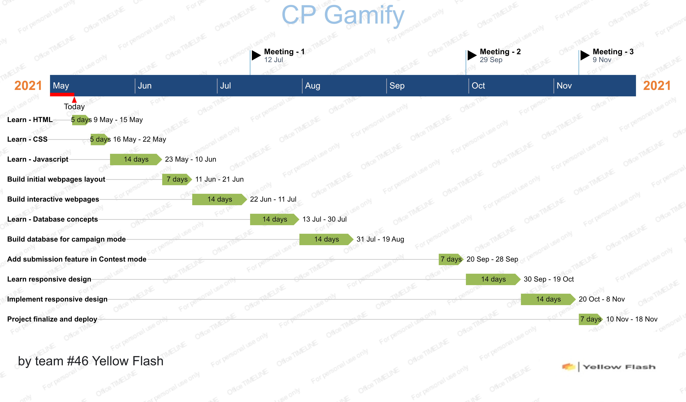

# G46-CP-Gamify

Expected Timeline : 

Report on Learning Pre-requisites
----------------------------------

SL | Learning Task | Description | Status | Comment |
--:|:--------------|:------------|:------:|---------|
1  | Web Development Fundamentals | HTML, CSS, JAVASCRIPT |   
2  | Front-end Development | BOOTSTRAP, JQUERY, DOM |   
3  | Back-end Development | NODE.JS, EXPRESS.JS, EJS, APIs |     
4  | DataBase | SQL DATABASE | 
5  | Others (if time left) | NOSQL DATABASE, MONGODB, REACT.JS |   

# Functionalities
- Helps students to find problems from different online judge based on their specific requirements
- Using the contest mode, students can create a contest and solve problems
- By using the handle name of the user, a student can get problems which he didn't solve in codeforces
- Students can also specify the rating of the problems
- Students can the select the number of problems that a student want to solve
- Contest Mode helps you to sharpen your coding skills
- In the career mode, you can solve problems and unlock the next level
- Career mode helps you to enjoy competitive programming and the learn DSA basics
- Sorry to say that career mode is still under construction and you can't access the career mode functionalitis right now

# Acknowlwdgement

  - Web Development bootcamp by Angela Yu
  - FreeCodeCamp Academy
  - Websites like w3schools, MDN web docs etc.
  - Youtube channels offer the web development learning
  - MD. Sayem Islam (2018331074)
  - Antor Roy (2018331040)

# Developers

### Group 46
### CP-Gamify

1. <b>Mahir Mosleh </b>
- Reg.No. 2018331064
- Cell: 01521566738
- E-mail:[mahirmosleh136@gmail.com](mailto:mahirmosleh136@gmail.com)
- GitHub: [Mahir_Mosleh](https://github.com/MahirRafid)
2. <b>Nasrullah Sami</b>
  - Reg.No: 2018331036
  - Cell: 01777951258
  - E-mail: [samrevolutionz69@gmail.com](mailto:samrevolutionz69@gmail.com)
  - GitHub: [Nasrullah Sami](https://github.com/sam4i40)
  

## Technologies
- HTML,CSS,JavaScript for Front-End .
- And for Back-End we have used Node.js,Express.js,Restful APIs
- MongoDB for Database.(mongodb atlas for uploading in cloud)
- We have set up the server locally
- And we also used css library Bootstrap.

# Contributions
 
### Mahir Mosleh
- Designing the front end of the app
- UI design
- Backend of Signin/Signup in career mode 
- Front end for home page
- Front end for Contest Mode page, Career Mode page and other front-ends
- Ensured responsiveness of the web application
- Database (locally + on cloud)
- Documentation,Description,Readme files and final submission video

### Nasrullah Sami
- Paved the idea as well as planned the structure and functionalities of the project
- Designed and implemented the algorithm to return curated problem list in the contest mode
- Showing the problem list using "ejs" in the problems.html page
- Created the presentation slide
